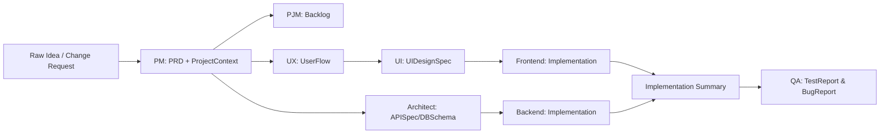
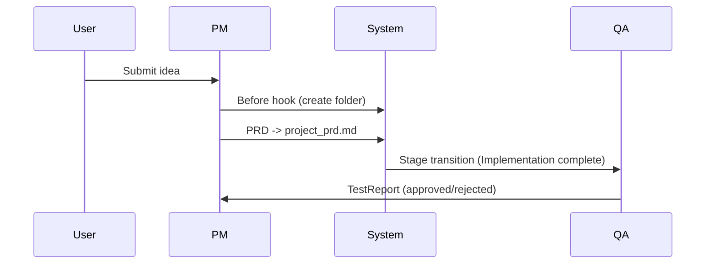

<p align="right">
  <a href="README_zh.md">🇨🇳 简体中文</a> | <b>🇺🇸 English</b>
</p>

# OpenClaw Dev Team (devteam)


## Table of Contents

- [Project Overview](#project-overview)
- [Key Features](#key-features)
- [Installation & Setup](#installation--setup)
- [Core Concepts](#core-concepts)
- [Workflow](#workflow)
- [Directory Structure](#directory-structure)
- [Agents Overview](#agents-overview)
- [Artifacts Overview](#artifacts-overview)
- [Hook Automation](#hook-automation)
- [Development & Extension](#development--extension)
- [Usage Examples](#usage-examples)
- [Compatibility](#compatibility)
- [License](#license)
- [FAQ](#faq)

---

## Project Overview

**OpenClaw Dev Team** is an artifact-first, multi-agent development pipeline that turns a raw idea into QA-ready delivery—**with auditable docs, deterministic stage transitions, and automated project scaffolding**.

**Why teams love it**
- ✅ **Zero-guesswork workflow**: Artifacts are the single source of truth.  
- ✅ **End-to-end coverage**: PM → PJM → UX/UI → Architect → Backend/Frontend → QA.  
- ✅ **Built-in ops hygiene**: Auto folders, logs, hooks, and strict stage gates.  
- ✅ **Change-safe**: PRD versioning and change-request governance.

---

## Key Features

1. **End-to-end virtual dev team support**: PM, PJM, UX/UI designers, architect, frontend/backend, QA  
2. **Document-driven workflow**: All requirements and PRD managed as artifacts  
3. **Automated project initialization**: Creates `$HOME/openclaw_workspace/project-{ProjectName}` automatically  
4. **Seamless PRD-folder integration**: PRD output written to project folder, README placeholder updated  
5. **Smart change handling**: Minor versions (v1.x) vs major versions (v2.0)  
6. **Configurable runtime environment**: `domain_context`, `language`, `tone`  

---

## Installation & Setup

```bash
# Clone the repository
git clone https://github.com/<your-username>/openclaw-agents-team-skill.git
cd openclaw-agents-team-skill

# Install OpenClaw >=0.5.0
pip install openclaw>=0.5.0

# Optional: customize workspace
export OPENCLAW_WORKSPACE=~/openclaw_workspace
````

> Default workspace is `~/openclaw_workspace`, used to store auto-created project folders and logs.

---

## Core Concepts

* **Agent**: Virtual team member role, with defined input/output artifacts
* **Artifact**: Document or data unit, e.g., `PRD`, `RawIdea`, `ChangeRequest`
* **Workflow Hooks**: Automation scripts executed at specific stages
* **Meta Block**: The first section of PRD, includes Project Name, version, author, etc.

---

## Workflow



**Explanation**:

1. User submits **RawIdea / ChangeRequest**
2. PM Agent generates PRD with Meta Block
3. **Before Hook** creates project folder and README.md
4. **After Hook** writes PRD file and updates README placeholder
5. Subsequent agents execute development and QA based on artifacts

**Lifecycle snapshot**



---


## Directory Structure (Example)

```text
openclaw-agents-team-skill/
├─ agents/
│  ├─ architect.yaml
│  ├─ backend.yaml
│  ├─ frontend.yaml
│  ├─ pjm.yaml
│  ├─ pm.yaml
│  ├─ qa.yaml
│  ├─ ui.yaml
│  └─ ux.yaml
├─ docs/
│  ├─ pm_conversation_templates.md
│  └─ pm_internal_sop.md
├─ examples/
│  ├─ basic_run.md
│  └─ custom_agent_override.md
├─ LICENSE
├─ README.md
├─ README_zh.md
├─ artifacts.yaml
├─ registry.yaml
├─ skill.yaml
├─ system_prompt.md
└─ $OPENCLAW_WORKSPACE/
    └─ project-{ProjectName}/
        ├─ README.md       # auto-generated, includes PRD placeholder
        └─ project_prd.md  # PRD file
```

---

## Agents Overview

| Agent            | Responsibility                                              |
| ---------------- | ----------------------------------------------------------- |
| PM               | Product Manager, generates PRD, handles change requests     |
| PJM              | Project Manager, coordinates dev schedule                   |
| UXDesigner       | User experience design, generates prototypes and user flows |
| UIDesigner       | UI design, generates interface designs                      |
| Architect        | System architecture design                                  |
| BackendEngineer  | Backend development                                         |
| FrontendEngineer | Frontend development                                        |
| QA               | Testing & acceptance                                        |

---

## Artifacts Overview

| Artifact      | Description                                                   |
| ------------- | ------------------------------------------------------------- |
| RawIdea       | User’s raw idea or requirement                                |
| ChangeRequest | User’s request to modify requirement                          |
| PRD           | Product Requirement Document (Markdown), includes Meta Block  |
| README.md     | Project description file, auto-generated with PRD placeholder |

---

## Hook Automation

* **Before Stage Hook (PM)**: creates project folder, generates README, logs actions
* **After Stage Hook (PM)**: writes PRD file, updates README placeholder

---

## Development & Extension

1. Add custom agents under `agents/` folder
2. Extend artifact types or add hook scripts
3. `agent_policy` supports full_replace / partial_extend for prompt overrides

---

## Usage Examples

Skill activation name: `devteam`.

### Example 1: Basic Run

```yaml
RawIdea:
  title: "Automated PRD Generation Demo"
  description: "System automatically generates PRD, creates project folder, updates README placeholder"
```

Run:

```bash
openclaw run skill devteam --input RawIdea.yaml
```

Output:

```
$HOME/openclaw_workspace/project-Automated_PRD_Generation_Demo/
├─ README.md
└─ project_prd.md
```

---

### Example 2: Custom PM Agent

In `agents/pm_custom.yaml`:

```yaml
role: Product Manager
stage: Planning
input:
  - RawIdea
output:
  - PRD
prompt: |
  You are a custom PM Agent.
  Output PRD, trigger hooks to create project folder, output must include Meta Block.
```

Run:

```bash
openclaw run skill devteam --override agents/pm_custom.yaml --input RawIdea.yaml
```

---

## Compatibility

* OpenClaw >= 0.5.0
* Supported platforms: Local / Cloud / Embedded

---

## License

MIT License. See [LICENSE](LICENSE) for details.

---

## FAQ

**Q1:** Can I customize the project folder location?

> Yes, set the environment variable `OPENCLAW_WORKSPACE`.

**Q2:** What if PRD Meta Project Name differs from RawIdea.title?

> The hook will prioritize PRD Meta Project Name; RawIdea.title is fallback.

**Q3:** Can multiple users generate PRD in parallel?

> Yes, `workflow_policy.allow_parallel_execution: true`.

**Q4:** How are ChangeRequests handled?

> PM evaluates according to SOP, generates minor version (v1.x) or major version (v2.0), hooks automatically write new files.

```

machine-precise underneath.

📜 License

MIT License
