<p align="right">
  <b>🇨🇳 简体中文</b> | <a href="README.md">🇺🇸 English</a>
</p>

# OpenClaw Dev Team（devteam）


## 目录

- [项目简介](#项目简介)
- [功能特色](#功能特色)
- [安装与配置](#安装与配置)
- [核心概念](#核心概念)
- [工作流程](#工作流程)
- [目录结构](#目录结构)
- [Agents 介绍](#agents-介绍)
- [Artifacts 说明](#artifacts-说明)
- [Hook 自动化功能](#hook-自动化功能)
- [开发与扩展](#开发与扩展)
- [使用示例](#使用示例)
- [兼容性](#兼容性)
- [许可证](#许可证)
- [FAQ](#faq)

---

## 项目简介

**OpenClaw Dev Team** 是一个以 Artifact 为核心的多 Agent 开发流水线，让「想法 → PRD → 设计 → 实现 → QA」全流程可追溯、可审计、可自动化。

**你会喜欢它的原因**
- ✅ **流程可控**：Artifact 是唯一事实源，阶段推进有硬性 Gate。  
- ✅ **覆盖完整**：PM → PJM → UX/UI → 架构 → 前后端 → QA。  
- ✅ **工程友好**：自动创建项目目录、写入文档、记录日志。  
- ✅ **需求变更安全**：PRD 版本化 + ChangeRequest 机制。

---

## 功能特色

1. **端到端虚拟开发团队支持**：PM、PJM、UX/UI 设计、架构师、前端/后端、QA  
2. **文档驱动流程**：所有需求和 PRD 都通过 Artifact 管理，可追溯  
3. **智能项目初始化**：自动创建 `$HOME/openclaw_workspace/project-{ProjectName}` 目录  
4. **PRD 与目录无缝衔接**：PRD 输出后自动写入项目目录，更新 README 占位符  
5. **智能变更处理**：小版本（v1.x）和主版本（v2.0）区分需求扩展和方向性变更  
6. **可配置运行环境**：domain_context / language / tone  

---

## 安装与配置

```bash
# 克隆仓库
git clone https://github.com/liuqin164/openclaw-agents-team-skill.git
cd openclaw-agents-team-skill

# 安装 OpenClaw >=0.5.0
pip install openclaw>=0.5.0

# 可选：自定义工作目录
export OPENCLAW_WORKSPACE=~/openclaw_workspace
````

> 默认工作目录为 `~/openclaw_workspace`，用于存放自动创建的项目文件夹和日志。

---

## 核心概念

* **Agent**：虚拟团队成员，每个角色有明确输入/输出 Artifact
* **Artifact**：文档或数据单元，如 `PRD`、`RawIdea`、`ChangeRequest`
* **Workflow Hooks**：自动化脚本，在特定阶段执行操作
* **Meta 区块**：PRD 文档首个章节，包含 Project Name、版本、作者等信息

---

## 工作流程

```mermaid
flowchart LR
  A[RawIdea / ChangeRequest] --> B[PM: PRD + ProjectContext]
  B --> C[PJM: Backlog]
  B --> D[UX: UserFlow]
  D --> E[UI: UIDesignSpec]
  B --> F[架构: APISpec/DBSchema]
  E --> G[前端: Implementation]
  F --> H[后端: Implementation]
  G --> I[Implementation Summary]
  H --> I
  I --> J[QA: TestReport & BugReport]
```




**说明**：

1. 用户提交 **RawIdea / ChangeRequest**
2. PM Agent 生成 PRD（包含 Meta 区块）
3. Before Hook 自动创建项目文件夹和 README.md
4. After Hook 写入 PRD 并更新 README 占位符
5. 后续团队 Agent 基于 Artifact 执行开发和验收

**生命周期示意**

```mermaid
sequenceDiagram
  participant 用户
  participant PM
  participant 系统
  participant QA

  用户->>PM: 提交需求
  PM->>系统: Before Hook（创建目录）
  PM->>系统: PRD 写入 project_prd.md
  系统->>QA: 阶段推进（实施完成）
  QA->>PM: TestReport（approved/rejected）
```



---

## Directory Structure (Example)

```text
openclaw-agents-team-skill/
├─ agents/
│  ├─ architect.yaml
│  ├─ backend.yaml
│  ├─ frontend.yaml
│  ├─ pjm.yaml
│  ├─ pm.yaml
│  ├─ qa.yaml
│  ├─ ui.yaml
│  └─ ux.yaml
├─ docs/
│  ├─ pm_conversation_templates.md
│  └─ pm_internal_sop.md
├─ examples/
│  ├─ basic_run.md
│  └─ custom_agent_override.md
├─ LICENSE
├─ README.md
├─ README_zh.md
├─ artifacts.yaml
├─ registry.yaml
├─ skill.yaml
├─ system_prompt.md
└─ $OPENCLAW_WORKSPACE/
    └─ project-{ProjectName}/
        ├─ README.md       # auto-generated, includes PRD placeholder
        └─ project_prd.md  # PRD file
```

---

## Agents Overview

| Agent            | Responsibility                                              |
| ---------------- | ----------------------------------------------------------- |
| PM               | Product Manager, generates PRD, handles change requests     |
| PJM              | Project Manager, coordinates dev schedule                   |
| UXDesigner       | User experience design, generates prototypes and user flows |
| UIDesigner       | UI design, generates interface designs                      |
| Architect        | System architecture design                                  |
| BackendEngineer  | Backend development                                         |
| FrontendEngineer | Frontend development                                        |
| QA               | Testing & acceptance                                        |

---

## Artifacts Overview

| Artifact      | Description                                                   |
| ------------- | ------------------------------------------------------------- |
| RawIdea       | User’s raw idea or requirement                                |
| ChangeRequest | User’s request to modify requirement                          |
| PRD           | Product Requirement Document (Markdown), includes Meta Block  |
| README.md     | Project description file, auto-generated with PRD placeholder |

---

## Hook Automation

* **Before Stage Hook (PM)**: creates project folder, generates README, logs actions
* **After Stage Hook (PM)**: writes PRD file, updates README placeholder

---

## Development & Extension

1. Add custom agents under `agents/` folder
2. Extend artifact types or add hook scripts
3. `agent_policy` supports full_replace / partial_extend for prompt overrides

---

## Usage Examples

Skill activation name: `devteam`.

### Example 1: Basic Run

```yaml
RawIdea:
  title: "Automated PRD Generation Demo"
  description: "System automatically generates PRD, creates project folder, updates README placeholder"
```

Run:

```bash
openclaw run skill devteam --input RawIdea.yaml
```

Output:

```
$HOME/openclaw_workspace/project-Automated_PRD_Generation_Demo/
├─ README.md
└─ project_prd.md
```

---

### Example 2: Custom PM Agent

In `agents/pm_custom.yaml`:

```yaml
role: Product Manager
stage: Planning
input:
  - RawIdea
output:
  - PRD
prompt: |
  You are a custom PM Agent.
  Output PRD, trigger hooks to create project folder, output must include Meta Block.
```

Run:

```bash
openclaw run skill devteam --override agents/pm_custom.yaml --input RawIdea.yaml
```

---

## Compatibility

* OpenClaw >= 0.5.0
* Supported platforms: Local / Cloud / Embedded

---

## License

MIT License. See [LICENSE](LICENSE) for details.

---

## FAQ

**Q1:** Can I customize the project folder location?

> Yes, set the environment variable `OPENCLAW_WORKSPACE`.

**Q2:** What if PRD Meta Project Name differs from RawIdea.title?

> The hook will prioritize PRD Meta Project Name; RawIdea.title is fallback.

**Q3:** Can multiple users generate PRD in parallel?

> Yes, `workflow_policy.allow_parallel_execution: true`.

**Q4:** How are ChangeRequests handled?

> PM evaluates according to SOP, generates minor version (v1.x) or major version (v2.0), hooks automatically write new files.

```

machine-precise underneath.

📜 License

MIT License
